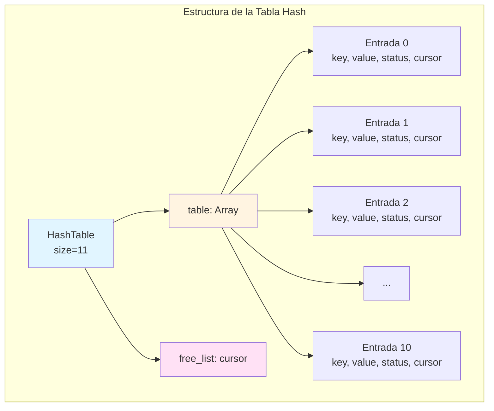
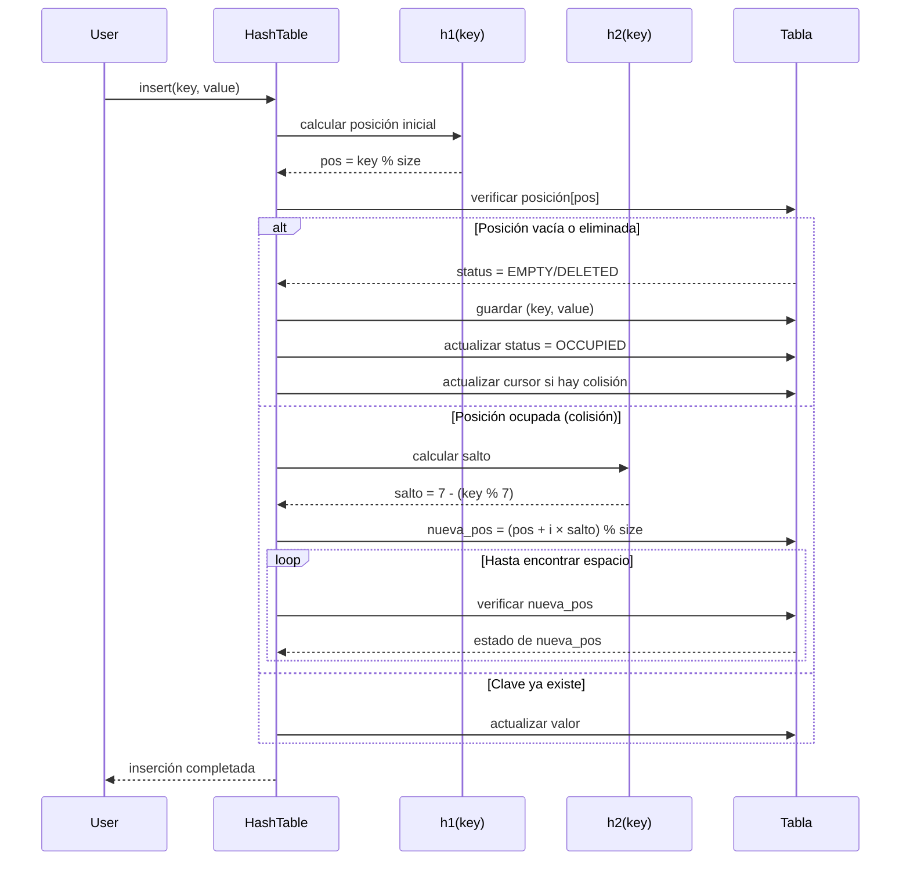
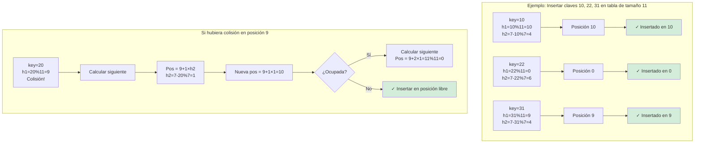

# 🔐 ED-II - Tabla Hash con Doble Hashing y Cursores


Una implementación educativa y completa de una **tabla hash** que utiliza **doble hashing** para resolver colisiones y **cursores** (simulación de punteros) para gestionar la estructura de datos de manera eficiente.

---

## 📋 Tabla de Contenidos

- [📖 Descripción](#-descripción)
- [✨ Características](#-características)
- [🚀 Inicio Rápido](#-inicio-rápido)
- [🏗️ Estructura de Datos](#️-estructura-de-datos)
- [🔄 Funcionamiento](#-funcionamiento)
- [🔧 Operaciones](#-operaciones)
- [💻 Uso y Ejemplos](#-uso-y-ejemplos)
- [📊 Ejemplo Visual](#-ejemplo-visual-del-doble-hashing)
- [📈 Análisis de Complejidad](#-análisis-de-complejidad)
- [📁 Estructura del Proyecto](#-estructura-del-proyecto)
- [🎯 Ventajas y Limitaciones](#-ventajas-y-limitaciones)
- [🔍 Preguntas Frecuentes](#-preguntas-frecuentes)
- [📚 Referencias](#-referencias)

---

## 📖 Descripción

Esta implementación de tabla hash combina técnicas avanzadas para optimizar el rendimiento y la gestión de memoria:

- **🔑 Doble Hashing**: Utiliza dos funciones hash (`h1` y `h2`) para calcular posiciones iniciales y resolver colisiones de manera uniforme
- **📦 Direccionamiento Abierto**: Los elementos se almacenan directamente en la tabla, sin necesidad de estructuras auxiliares como listas enlazadas
- **👆 Cursores**: Simulación de punteros mediante índices para referenciar posiciones relacionadas en la tabla
- **🏷️ Marcado Lógico**: Los elementos eliminados se marcan como `DELETED` para mantener la integridad de la secuencia de búsqueda

### ¿Cuándo usar esta implementación?

- ✅ Cuando necesitas acceso rápido O(1) promedio a datos
- ✅ Para sistemas donde la distribución uniforme es importante
- ✅ Cuando trabajas con claves numéricas enteras
- ✅ En aplicaciones educativas para aprender hashing

---

## ✨ Características

| Característica | Descripción |
|----------------|-------------|
| 🔄 **Funciones Hash Duales** | `h1(key)` calcula posición inicial, `h2(key)` calcula el salto para colisiones |
| 🎯 **Manejo de Colisiones** | Resolución eficiente mediante doble hashing con direccionamiento abierto |
| 🔗 **Sistema de Cursores** | Referencias entre posiciones relacionadas usando índices |
| 🗑️ **Eliminación Lógica** | Marcado de elementos eliminados sin romper la secuencia de búsqueda |
| 📋 **Lista de Espacios Libres** | Gestión eficiente de espacios previamente eliminados |
| 🔍 **Operaciones Completas** | Inserción, búsqueda, eliminación y visualización detallada |
| 📊 **Estadísticas** | Cálculo automático de factor de carga y métricas de uso |
| 🎨 **Visualización** | Representación clara del estado interno de la tabla |

---

## 🚀 Inicio Rápido

### Requisitos

- **Python 3.7+** (no se requieren dependencias externas)

### Instalación

```bash
# Clonar el repositorio
git clone <url-del-repositorio>
cd ED-II

# No requiere instalación adicional
# ¡Listo para usar!
```

### Ejemplo Básico (5 líneas)

```python
from src.hashing.hash_table_double_hashing import HashTable

ht = HashTable(size=11)
ht.insert(10, "A")
ht.insert(22, "B")
print(ht.search(22))  # Output: B
ht.display()  # Muestra la tabla completa
```

### Ejecutar la Demostración

```bash
# Ejecutar el programa con ejemplos incluidos
python3 src/hashing/hash_table_double_hashing.py
```

**Salida esperada:**
```
======================================================================
DEMOSTRACIÓN: TABLA HASH CON DOBLE HASHING Y CURSORES
======================================================================

1. INSERTANDO ELEMENTOS
----------------------------------------------------------------------
✓ Insertado: clave=10, valor=A
✓ Insertado: clave=22, valor=B
...

======================================================================
TABLA HASH CON DOBLE HASHING Y CURSORES
======================================================================
Índice   | Clave    | Valor      | Estado       | Cursor  
----------------------------------------------------------------------
0        | 22       | B          | OCCUPIED     | None    
1        | 88       | H          | OCCUPIED     | None    
...
```

---

## 🏗️ Estructura de Datos

Cada entrada en la tabla hash contiene cuatro componentes:

```python
{
    'key': None,        # Clave del elemento (o None si está vacía)
    'value': None,      # Valor asociado (o None si está vacía)
    'status': 'EMPTY',  # Estado: 'EMPTY', 'OCCUPIED', 'DELETED'
    'cursor': None      # Índice que apunta a la siguiente posición relacionada
}
```

### Diagrama de Estructura



### Estados de una Entrada

| Estado | Descripción | Uso |
|--------|-------------|-----|
| `EMPTY` | Posición nunca utilizada | Indica que nunca se insertó nada aquí |
| `OCCUPIED` | Posición con elemento válido | Contiene un par clave-valor activo |
| `DELETED` | Posición con elemento eliminado | Mantiene la secuencia pero permite reutilización |

---

## 🔄 Funcionamiento

### Funciones Hash

#### Primera Función Hash: `h1(key)`

Calcula la **posición inicial** en la tabla:

```
h1(key) = key % tamaño_tabla
```

**Ejemplo:**
- `h1(22)` en tabla de tamaño 11 = `22 % 11 = 0`
- `h1(31)` en tabla de tamaño 11 = `31 % 11 = 9`

#### Segunda Función Hash: `h2(key)`

Calcula el **salto** para resolver colisiones:

```
h2(key) = 7 - (key % 7)
```

**Ejemplo:**
- `h2(22)` = `7 - (22 % 7)` = `7 - 1` = `6`
- `h2(31)` = `7 - (31 % 7)` = `7 - 3` = `4`

#### Fórmula de Doble Hashing

Cuando hay colisión, se calcula una nueva posición:

```
posición = (h1(key) + i × h2(key)) % tamaño_tabla
donde i = 0, 1, 2, 3, ... (número de intentos)
```

**Ejemplo práctico:**
- Inserción de clave `22`: `pos = (0 + 0×6) % 11 = 0`
- Si posición 0 está ocupada, siguiente intento: `pos = (0 + 1×6) % 11 = 6`
- Si posición 6 está ocupada: `pos = (0 + 2×6) % 11 = 1`

### Diagrama de Funcionamiento General

```mermaid
flowchart TD
    Start([Operación]) --> Check{¿Qué operación?}
    
    Check -->|Insertar| Insert[INSERT]
    Check -->|Buscar| Search[SEARCH]
    Check -->|Eliminar| Delete[DELETE]
    
    Insert --> Calc1[Calcular h1(key)]
    Calc1 --> Pos1[Posición = h1(key)]
    Pos1 --> CheckPos1{¿Posición libre?}
    CheckPos1 -->|Sí| Save1[Guardar elemento]
    CheckPos1 -->|No| Calc2[Calcular salto h2(key)]
    Calc2 --> NewPos1[Nueva posición = Pos + i × h2(key)]
    NewPos1 --> CheckPos1
    
    Search --> Calc3[Calcular h1(key)]
    Calc3 --> Pos2[Posición = h1(key)]
    Pos2 --> CheckPos2{¿Clave encontrada?}
    CheckPos2 -->|Sí| Return1[Retornar valor]
    CheckPos2 -->|No| CheckEmpty{¿Vacío?}
    CheckEmpty -->|Sí| Return2[Retornar None]
    CheckEmpty -->|No| Calc4[Calcular siguiente con h2]
    Calc4 --> CheckPos2
    
    Delete --> Calc5[Calcular h1(key)]
    Calc5 --> Pos3[Posición = h1(key)]
    Pos3 --> CheckPos3{¿Clave encontrada?}
    CheckPos3 -->|Sí| Mark[Marcar como DELETED]
    CheckPos3 -->|No| Return3[No hacer nada]
    Mark --> Update[Actualizar lista de libres]
    
    Save1 --> End([Fin])
    Return1 --> End
    Return2 --> End
    Update --> End
    Return3 --> End
    
    style Start fill:#e1f5ff
    style End fill:#e1f5ff
    style Check fill:#fff4e1
```

---

## 🔧 Operaciones

### 1. Inserción (Insert)

Inserta un par clave-valor en la tabla. Si hay colisión, utiliza doble hashing para encontrar una posición libre.

**Firma:**
```python
def insert(self, key, value) -> None
```

**Comportamiento:**
- Si la posición inicial está libre, inserta directamente
- Si hay colisión, calcula nuevas posiciones usando `h2(key)`
- Si la clave ya existe, actualiza el valor
- Lanza excepción si la tabla está llena

**Diagrama de Secuencia:**



**Ejemplo:**
```python
ht = HashTable(size=11)
ht.insert(22, "B")  # Se inserta en posición h1(22) = 0
ht.insert(33, "C")  # Si h1(33) = 0, colisión → usa h2(33)
```

### 2. Búsqueda (Search)

Busca un valor en la tabla usando su clave.

**Firma:**
```python
def search(self, key) -> value | None
```

**Comportamiento:**
- Calcula posición inicial con `h1(key)`
- Si no encuentra, recorre la secuencia usando `h2(key)`
- Retorna el valor si existe, `None` si no se encuentra

**Diagrama de Flujo:**

```mermaid
flowchart LR
    Start([Buscar key]) --> H1[Calcular h1(key)]
    H1 --> Pos[Posición inicial]
    Pos --> Check{¿key encontrada?}
    Check -->|Sí y OCCUPIED| Found[✓ Valor encontrado]
    Check -->|No y EMPTY| NotFound[✗ No existe]
    Check -->|No y OCCUPIED/DELETED| Next[Calcular siguiente]
    Next --> Calc[Pos = h1 + i × h2]
    Calc --> Check
    Found --> End([Retornar valor])
    NotFound --> End2([Retornar None])
    
    style Start fill:#e1f5ff
    style Found fill:#d4edda
    style NotFound fill:#f8d7da
    style End fill:#e1f5ff
    style End2 fill:#e1f5ff
```

**Ejemplo:**
```python
valor = ht.search(22)  # Retorna "B" o None
if valor:
    print(f"Encontrado: {valor}")
else:
    print("No encontrado")
```

### 3. Eliminación (Delete)

Elimina un elemento marcándolo como `DELETED` sin romper la secuencia de búsqueda.

**Firma:**
```python
def delete(self, key) -> None
```

**Comportamiento:**
- Busca el elemento usando doble hashing
- Marca como `DELETED` en lugar de vaciar completamente
- Agrega a la lista de espacios libres
- Mantiene la integridad de la secuencia de búsqueda

**Diagrama de Flujo:**

```mermaid
flowchart TD
    Start([Eliminar key]) --> H1[Calcular h1(key)]
    H1 --> Pos[Posición inicial]
    Pos --> Check{¿key encontrada?}
    Check -->|Sí y OCCUPIED| Mark[Marcar como DELETED]
    Check -->|No y EMPTY| Skip[No hacer nada]
    Check -->|No y OCCUPIED/DELETED| Next[Calcular siguiente]
    
    Mark --> Clear[Limpiar key y value]
    Clear --> UpdateCursor[Actualizar cursor]
    UpdateCursor --> FreeList[Agregar a lista de libres]
    FreeList --> End([Eliminación completa])
    
    Next --> Calc[Pos = h1 + i × h2]
    Calc --> Check
    Skip --> End2([Fin sin cambios])
    
    style Start fill:#e1f5ff
    style Mark fill:#fff3cd
    style FreeList fill:#ffe1f5
    style End fill:#e1f5ff
```

**Ejemplo:**
```python
ht.delete(22)  # Marca como DELETED, puede reinsertarse después
ht.insert(22, "B_NUEVO")  # Reutiliza el espacio
```

---

## 💻 Uso y Ejemplos

### Uso Básico Completo

```python
from src.hashing.hash_table_double_hashing import HashTable

# Crear tabla hash
ht = HashTable(size=11)

# Insertar elementos
ht.insert(10, "A")
ht.insert(22, "B")
ht.insert(31, "C")
ht.insert(4, "D")
ht.insert(15, "E")

# Buscar elemento
valor = ht.search(22)  # Retorna "B"
print(f"Valor encontrado: {valor}")

# Eliminar elemento
ht.delete(22)

# Visualizar tabla
ht.display()

# Obtener estadísticas
stats = ht.get_statistics()
print(f"\nFactor de carga: {stats['load_factor']:.2%}")
print(f"Ocupadas: {stats['occupied']}/{stats['total_slots']}")
```

### Ejemplo 1: Manejo de Colisiones

```python
ht = HashTable(size=11)

# Insertar elementos que pueden causar colisiones
ht.insert(22, "B")  # h1(22) = 0
ht.insert(33, "C")  # h1(33) = 0 (colisión!)

# El doble hashing resuelve la colisión
ht.display()
```

**Salida:**
```
Índice   | Clave    | Valor      | Estado       | Cursor  
----------------------------------------------------------------------
0        | 22       | B          | OCCUPIED     | None    
1        | 33       | C          | OCCUPIED     | None    (después de colisión)
...
```

### Ejemplo 2: Búsqueda y Eliminación

```python
ht = HashTable(size=11)
ht.insert(10, "A")
ht.insert(22, "B")
ht.insert(31, "C")

# Buscar elementos existentes y no existentes
resultado1 = ht.search(22)  # Retorna "B"
resultado2 = ht.search(99)  # Retorna None

print(f"Búsqueda de 22: {resultado1}")  # Output: B
print(f"Búsqueda de 99: {resultado2}")  # Output: None

# Eliminar y reinsertar
ht.delete(22)
print("Después de eliminar 22:")
ht.display()

ht.insert(22, "B_NUEVO")  # Reutiliza el espacio DELETED
print("\nDespués de reinsertar:")
ht.display()
```

### Ejemplo 3: Estadísticas y Monitoreo

```python
ht = HashTable(size=11)

# Llenar parcialmente la tabla
for i in range(8):
    ht.insert(i * 11, f"Valor_{i}")

# Obtener estadísticas
stats = ht.get_statistics()

print("📊 Estadísticas de la Tabla Hash:")
print(f"  • Total de slots: {stats['total_slots']}")
print(f"  • Ocupados: {stats['occupied']}")
print(f"  • Vacíos: {stats['empty']}")
print(f"  • Eliminados: {stats['deleted']}")
print(f"  • Factor de carga: {stats['load_factor']:.2%}")
```

---

## 📊 Ejemplo Visual del Doble Hashing

Visualización paso a paso de cómo se resuelven las colisiones:



### Tabla Paso a Paso

| Clave | h1(key) | h2(key) | Intento | Posición Calculada | Estado |
|-------|---------|---------|---------|-------------------|--------|
| 10 | 10 | 4 | 0 | 10 | ✅ Insertado |
| 22 | 0 | 6 | 0 | 0 | ✅ Insertado |
| 31 | 9 | 4 | 0 | 9 | ✅ Insertado |
| 20 | 9 | 1 | 0 | 9 (ocupada) | ⚠️ Colisión |
| 20 | 9 | 1 | 1 | 10 (ocupada) | ⚠️ Colisión |
| 20 | 9 | 1 | 2 | 0 (ocupada) | ⚠️ Colisión |
| 20 | 9 | 1 | 3 | 1 | ✅ Insertado |

---

## 📈 Análisis de Complejidad

### Complejidad Temporal

| Operación | Complejidad Promedio | Complejidad Peor Caso | Notas |
|-----------|---------------------|----------------------|-------|
| **Inserción** | O(1) | O(n) | Promedio excelente, peor caso cuando tabla casi llena |
| **Búsqueda** | O(1) | O(n) | Acceso directo en promedio |
| **Eliminación** | O(1) | O(n) | Búsqueda + marcado constante |
| **Visualización** | O(n) | O(n) | Recorre toda la tabla |

### Complejidad Espacial

- **Espacio Total**: O(n) donde n es el tamaño de la tabla
- **Cada Entrada**: O(1) espacio constante
- **Overhead**: Mínimo, solo campos adicionales (status, cursor)

### Rendimiento por Factor de Carga

| Factor de Carga | Tiempo Promedio | Rendimiento |
|----------------|-----------------|-------------|
| < 0.5 | O(1) | ⭐⭐⭐⭐⭐ Excelente |
| 0.5 - 0.75 | O(1) | ⭐⭐⭐⭐ Muy Bueno |
| 0.75 - 0.9 | O(1) - O(log n) | ⭐⭐⭐ Bueno |
| > 0.9 | O(n) | ⭐⭐ Degradado |

**Recomendación:** Mantener el factor de carga < 0.75 para rendimiento óptimo.

---

## 📁 Estructura del Proyecto

```
ED-II/
├── README.md                              # Este archivo
├── src/
│   └── hashing/
│       └── hash_table_double_hashing.py   # Implementación principal
├── tests/                                  # Pruebas unitarias (si existen)
├── docs/                                   # Documentación adicional (si existe)
└── examples/                               # Ejemplos de uso adicionales
```

### Archivos Principales

- **`src/hashing/hash_table_double_hashing.py`**: Implementación completa de la tabla hash con doble hashing y cursores
  - Clase `HashTable`: Implementación principal
  - Métodos: `insert()`, `search()`, `delete()`, `display()`, `get_statistics()`
  - Función `main()`: Demostración con ejemplos

---

## 🎯 Ventajas y Limitaciones

### ✅ Ventajas

| Ventaja | Descripción |
|---------|-------------|
| **🚀 Eficiencia** | Acceso promedio O(1) para operaciones básicas |
| **📊 Distribución Uniforme** | El doble hashing distribuye mejor los elementos que el sondeo lineal |
| **💾 Gestión de Memoria** | Los espacios eliminados se pueden reutilizar eficientemente |
| **🔗 Integridad** | El marcado lógico mantiene la secuencia de búsqueda correcta |
| **🎓 Educativo** | Excelente para entender conceptos de hashing |

### ⚠️ Limitaciones

| Limitación | Descripción | Solución Sugerida |
|------------|-------------|-------------------|
| **📏 Tamaño Fijo** | La tabla tiene un tamaño predefinido | Usar rehashing para redimensionar |
| **⚖️ Factor de Carga** | Rendimiento óptimo cuando < 0.75 | Monitorear estadísticas y redimensionar |
| **🔢 Tipo de Claves** | Optimizado para claves numéricas enteras | Adaptar funciones hash para otros tipos |
| **💥 Colisiones** | Si el tamaño no es primo, puede haber más colisiones | Usar siempre tamaños primos |

---

## 🔍 Preguntas Frecuentes

### ¿Por qué usar doble hashing en lugar de sondeo lineal?

El doble hashing proporciona una **distribución más uniforme** de los elementos y reduce la agrupación primaria (primary clustering) que ocurre con el sondeo lineal.

### ¿Qué pasa si la tabla se llena?

El método `insert()` lanzará una excepción `Exception("Tabla llena: No se puede insertar más elementos")`. Se recomienda monitorear el factor de carga y redimensionar si es necesario.

### ¿Por qué no se vacían completamente las posiciones eliminadas?

El marcado lógico (`DELETED`) mantiene la **integridad de la secuencia de búsqueda**. Si se vaciaran, las búsquedas se detendrían prematuramente al encontrar un espacio vacío.

### ¿Cómo elegir el tamaño de la tabla?

- Usa **números primos** para mejor distribución
- Elige un tamaño aproximadamente **1.3-1.5 veces** el número esperado de elementos
- Ejemplos: 11, 17, 23, 31, 41, 53, etc.

### ¿Se pueden usar claves no numéricas?

La implementación actual está optimizada para claves numéricas enteras. Para otros tipos, adapta las funciones hash `h1()` y `h2()`.

---

## 📚 Referencias

### Conceptos Clave

- **Doble Hashing**: Técnica de resolución de colisiones usando dos funciones hash
- **Direccionamiento Abierto**: Método donde los elementos se almacenan directamente en la tabla
- **Cursores**: Simulación de punteros usando índices en lugar de direcciones de memoria
- **Factor de Carga**: Razón entre elementos ocupados y tamaño total de la tabla

### Lecturas Recomendadas

1. *Introduction to Algorithms* (Cormen et al.) - Capítulo 11: Hash Tables
2. *Data Structures and Algorithms in Python* (Goodrich et al.) - Sección 10.2
3. *Algorithms* (Sedgewick & Wayne) - Sección 3.4: Hash Tables

---

## 👤 Autor

Implementación educativa para el curso de **Estructuras de Datos II**.

---

## 📄 Licencia

Este proyecto es de código abierto y está disponible para uso educativo.

---

<div align="center">

**⭐ Si este proyecto te resultó útil, considera darle una estrella ⭐**

Made with ❤️ for learning data structures

</div>
