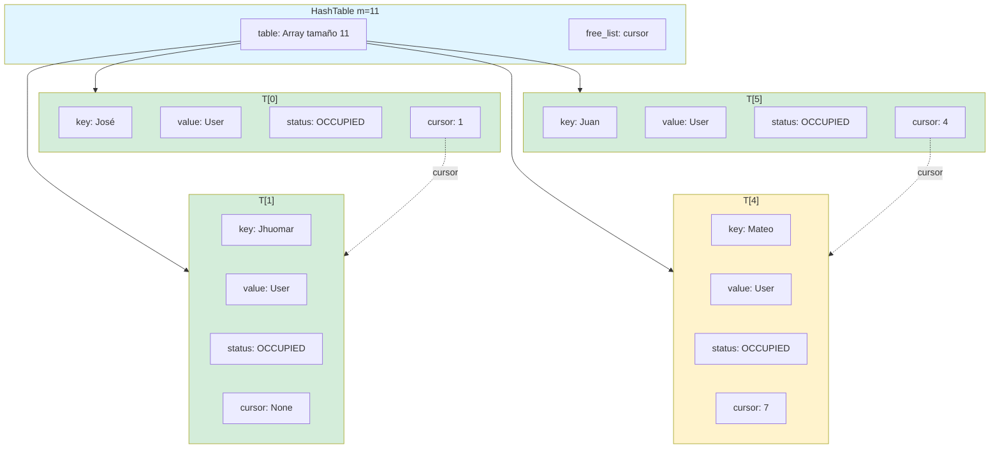
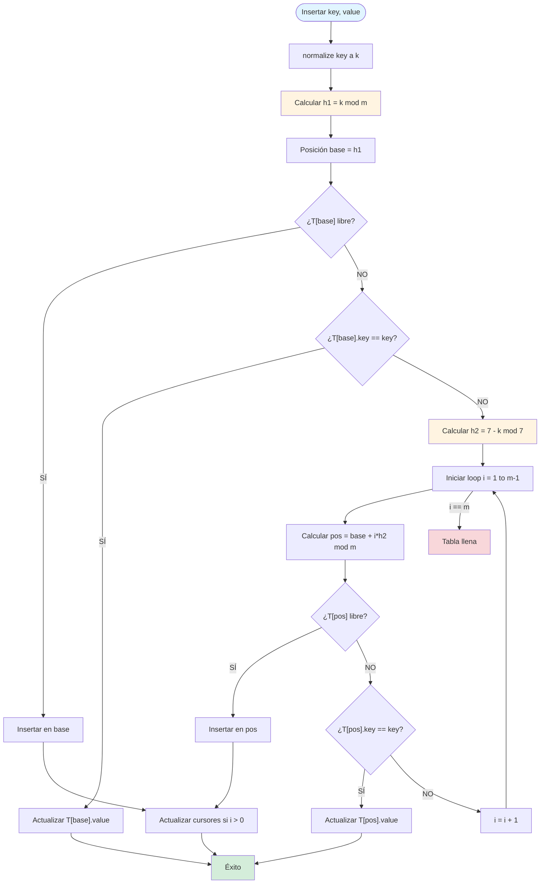
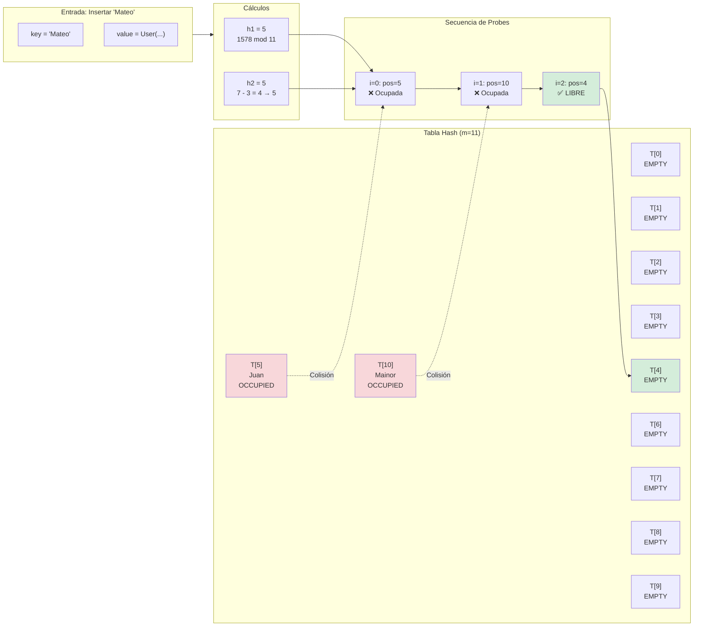

# 🔐 ED-II - Tabla Hash con Doble Hashing y Cursores


Una implementación educativa y completa de una **tabla hash** que utiliza **doble hashing** para resolver colisiones y **cursores** (simulación de punteros) para gestionar la estructura de datos de manera eficiente.

---

## 📋 Tabla de Contenidos

- [📖 Descripción](#-descripción)
- [🔢 Fundamentos Matemáticos](#-fundamentos-matemáticos)
- [🏗️ Estructura de Datos](#️-estructura-de-datos)
- [🔄 Funcionamiento del Doble Hashing](#-funcionamiento-del-doble-hashing)
- [🚀 Inicio Rápido](#-inicio-rápido)
- [💻 Sistema de Login](#-sistema-de-login)
- [📊 Análisis de Complejidad](#-análisis-de-complejidad)
- [📁 Estructura del Proyecto](#-estructura-del-proyecto)
- [🔍 Preguntas Frecuentes](#-preguntas-frecuentes)

---

## 📖 Descripción

Esta implementación de tabla hash combina técnicas avanzadas para optimizar el rendimiento y la gestión de memoria:

- **🔑 Doble Hashing**: Utiliza dos funciones hash (`h1` y `h2`) para calcular posiciones iniciales y resolver colisiones de manera uniforme
- **📦 Direccionamiento Abierto**: Los elementos se almacenan directamente en la tabla, sin necesidad de estructuras auxiliares como listas enlazadas
- **👆 Cursores**: Simulación de punteros mediante índices para referenciar posiciones relacionadas en la tabla
- **🏷️ Marcado Lógico**: Los elementos eliminados se marcan como `DELETED` para mantener la integridad de la secuencia de búsqueda

---

## 🔢 Fundamentos Matemáticos

### Definición Formal de Tabla Hash

Una tabla hash es una estructura de datos que implementa un **array** de tamaño fijo `m`:

```
T = {T[0], T[1], T[2], ..., T[m-1]}
```

Donde cada elemento `T[i]` es una tupla:

```
T[i] = (key, value, status, cursor)
```

**Dominios:**
- `key ∈ ℤ ∪ Σ*` (enteros o strings)
- `value ∈ V` (cualquier tipo de valor)
- `status ∈ {EMPTY, OCCUPIED, DELETED}`
- `cursor ∈ ℕ ∪ {None}` (índice al siguiente elemento relacionado)

### Función Hash h1: Posición Base

La función `h1` calcula la posición inicial en la tabla:

```
h1(key) = normalize(key) mod m
```

Donde `normalize(key)` convierte la clave a un entero:

**Para strings:**
```
normalize(s) = Σ(i=1 to |s|) i × ASCII(s[i])
```

**Para enteros:**
```
normalize(k) = k
```

**Ejemplo matemático:**
```
h1("Juan") = normalize("Juan") mod 11
           = (1×74 + 2×117 + 3×97 + 4×110) mod 11
           = 1039 mod 11
           = 5
```

### Función Hash h2: Salto para Colisiones

La función `h2` calcula el "salto" cuando hay colisión:

```
h2(key) = {
  7 - (normalize(key) mod 7)  si 7 - (normalize(key) mod 7) ≠ 0
  1                            si 7 - (normalize(key) mod 7) = 0
}
```

**Propiedades:**
- `h2(key) > 0` (siempre positivo)
- Preferiblemente **impar** y **coprimo con m**
- Si es par, se ajusta: `h2(key) = h2(key) + 1` (si no excede m)

**Ejemplo:**
```
h2("Mateo") = 7 - (1578 mod 7)
            = 7 - 3
            = 4
            → Ajustado a impar: 5
```

### Fórmula del Doble Hashing

La posición final se calcula mediante:

```
pos(key, i) = (h1(key) + i × h2(key)) mod m
```

Donde:
- `i ∈ {0, 1, 2, ..., m-1}` es el número de intento (probe)
- `i = 0` corresponde a la posición base
- `i > 0` se usa cuando hay colisiones

**Ejemplo de resolución de colisión:**
```
Para key = "Mateo", h1 = 5, h2 = 5, m = 11:

i = 0: pos = (5 + 0×5) mod 11 = 5  ❌ Ocupada
i = 1: pos = (5 + 1×5) mod 11 = 10 ❌ Ocupada
i = 2: pos = (5 + 2×5) mod 11 = 4  ✅ LIBRE → Insertar aquí
```

---

## 🏗️ Estructura de Datos

### Representación de la Tabla

```
┌─────────────────────────────────────────┐
│         HashTable (m = 11)              │
├─────────────────────────────────────────┤
│  table: Array[T[0..10]]                 │
│  free_list: cursor (índice o None)      │
└─────────────────────────────────────────┘
```

### Estructura de Cada Entrada

```
┌─────────────────────────────────────┐
│  T[i] = {                           │
│    key: ℤ ∪ Σ*                      │
│    value: V                         │
│    status: {EMPTY, OCCUPIED, DELETED}│
│    cursor: ℕ ∪ {None}               │
│  }                                  │
└─────────────────────────────────────┘
```

### Diagrama Visual Simple

```
Tabla Hash (m = 11)
┌─────┬─────┬─────┬─────┬─────┬─────┬─────┬─────┬─────┬─────┬─────┐
│  0  │  1  │  2  │  3  │  4  │  5  │  6  │  7  │  8  │  9  │ 10  │
├─────┼─────┼─────┼─────┼─────┼─────┼─────┼─────┼─────┼─────┼─────┤
│ José│Jhuom│Jhonn│Henry│Mateo│ Juan│Anton│Javie│Jonna│Pedro│Maino│
│     │ ar  │ y   │     │     │     │ y   │ r   │ s   │     │ r   │
│ c:1 │ c:- │ c:3 │ c:- │ c:7 │ c:- │ c:- │ c:- │ c:- │ c:- │ c:6 │
└─────┴─────┴─────┴─────┴─────┴─────┴─────┴─────┴─────┴─────┴─────┘
  ↑                                    ↑
  │                                    │
  └──── cursor apunta a Jhuomar ──────┘
```

**Leyenda:**
- `c:` = cursor (índice al siguiente elemento relacionado)
- `-` = cursor = None (fin de cadena)

### Diagrama Mermaid: Estructura de la Tabla Hash



### Estados de una Entrada

| Estado | Símbolo | Descripción Matemática |
|--------|---------|----------------------|
| `EMPTY` | `∅` | `T[i].status = EMPTY` → Nunca se insertó nada |
| `OCCUPIED` | `●` | `T[i].status = OCCUPIED` → Contiene un par (key, value) válido |
| `DELETED` | `✗` | `T[i].status = DELETED` → Eliminado pero mantiene secuencia |

---

## 🔄 Funcionamiento del Doble Hashing

### Proceso de Inserción

**Algoritmo matemático:**

```
insert(key, value):
  1. k = normalize(key)
  2. base = h1(k) = k mod m
  3. step = h2(k)
  4. Para i = 0 hasta m-1:
       pos = (base + i × step) mod m
       Si T[pos].status == EMPTY o DELETED:
         T[pos] = (key, value, OCCUPIED, None)
         Actualizar cursores si i > 0
         Retornar True
       Si T[pos].key == key:
         T[pos].value = value  // Actualizar
         Retornar True
  5. Retornar False  // Tabla llena
```

### Diagrama de Flujo Simple

```
INSERTAR
   │
   ├─→ Calcular h1(key) → posición base
   │
   ├─→ ¿Posición libre?
   │   ├─→ SÍ → Insertar → FIN
   │   └─→ NO → Calcular h2(key) → salto
   │            │
   │            └─→ Nueva posición = (base + i × salto) mod m
   │                 │
   │                 └─→ Repetir hasta encontrar espacio libre
```

### Diagrama Mermaid: Proceso de Inserción con Doble Hashing



### Ejemplo Matemático Completo

**Insertar "Mateo" cuando "Juan" ya está en posición 5:**

```
Datos:
  h1("Mateo") = 5
  h2("Mateo") = 5
  m = 11
  T[5] está ocupada por "Juan"

Secuencia de probes:
  i=0: pos = (5 + 0×5) mod 11 = 5  → Ocupada por Juan
  i=1: pos = (5 + 1×5) mod 11 = 10 → Ocupada por Mainor
  i=2: pos = (5 + 2×5) mod 11 = 4  → ✅ LIBRE

Resultado: "Mateo" se inserta en posición 4
```

### Proceso de Búsqueda

**Algoritmo matemático:**

```
search(key):
  1. k = normalize(key)
  2. base = h1(k)
  3. step = h2(k)
  4. Para i = 0 hasta m-1:
       pos = (base + i × step) mod m
       Si T[pos].status == OCCUPIED y T[pos].key == key:
         Retornar T[pos].value
       Si T[pos].status == EMPTY:
         Retornar None  // No existe
  5. Retornar None
```

### Proceso de Eliminación

**Algoritmo matemático:**

```
delete(key):
  1. Buscar key usando search()
  2. Si encontrado en posición pos:
       T[pos].status = DELETED
       T[pos].key = None
       T[pos].value = None
       T[pos].cursor = free_list
       free_list = pos
       Actualizar cursores que apuntaban a pos
       Retornar True
  3. Retornar False
```

---

## 🚀 Inicio Rápido

### Requisitos

- **Python 3.7+** (no se requieren dependencias externas)

### Instalación

```bash
# Clonar el repositorio
git clone <url-del-repositorio>
cd ED-II

# No requiere instalación adicional
# ¡Listo para usar!
```

### Ejemplo Básico

```python
from src.hashing.hash_table_double_hashing import HashTable

# Crear tabla hash
ht = HashTable(size=11)

# Insertar elementos
ht.insert(10, "A")
ht.insert(22, "B")

# Buscar
valor = ht.search(22)  # Retorna "B"
print(valor)

# Visualizar tabla
ht.display()
```

### Ejecutar el Sistema de Login

```bash
# Desde la raíz del proyecto
python3 src/login.py

# O desde dentro de src/
cd src
python3 login.py
```

---

## 💻 Sistema de Login

El proyecto incluye un sistema completo de registro y autenticación de usuarios que demuestra el uso práctico de la tabla hash.

### Características

- ✅ Registro de usuarios
- ✅ Autenticación con verificación de contraseña
- ✅ Visualización de la tabla hash
- ✅ Estadísticas de uso
- ✅ Análisis de colisiones

### Uso del Sistema

Al ejecutar `src/login.py`, verás un menú interactivo:

```
======================================================================
Sistema de Registro y Autenticación de Usuarios
Usando Hash Table con Doble Hashing y Cursores
======================================================================

----------------------------------------------------------------------
Seleccione una opción:
1. Registrar un nuevo usuario
2. Autenticar un usuario existente
3. Mostrar tabla hash
4. Mostrar estadísticas
5. Mostrar análisis de colisiones
6. Salir
----------------------------------------------------------------------
```

### Ejemplo de Uso

```python
# El sistema internamente hace:
from src.hashing.hash_table_double_hashing import HashTable
from src.login import User

hash_table = HashTable(size=11)
user = User("Juan", "password123")
hash_table.insert("Juan", user)

# Buscar usuario
stored_user = hash_table.search("Juan")
if stored_user and stored_user.password == "password123":
    print("Autenticación exitosa")
```

---

## 📊 Análisis de Complejidad

### Complejidad Temporal

| Operación | Mejor Caso | Caso Promedio | Peor Caso | Notas |
|-----------|-----------|---------------|-----------|-------|
| **Insert** | O(1) | O(1/(1-α)) | O(m) | α = factor de carga |
| **Search** | O(1) | O(1/(1-α)) | O(m) | Si está en posición base |
| **Delete** | O(1) | O(1/(1-α)) | O(m) | Búsqueda + actualización |

**Donde:**
- `α = n/m` (factor de carga)
- `n` = número de elementos ocupados
- `m` = tamaño de la tabla

### Análisis del Factor de Carga

El número esperado de probes (intentos) es:

```
E[probes] ≈ 1 / (1 - α)
```

**Tabla de rendimiento:**

| Factor de Carga (α) | E[probes] | Rendimiento |
|---------------------|-----------|-------------|
| 0.25 | 1.33 | ⭐⭐⭐⭐⭐ Excelente |
| 0.50 | 2.00 | ⭐⭐⭐⭐ Muy Bueno |
| 0.75 | 4.00 | ⭐⭐⭐ Bueno |
| 0.90 | 10.00 | ⭐⭐ Degradado |
| 1.00 | ∞ | ❌ Tabla llena |

**Recomendación:** Mantener `α < 0.75` para rendimiento óptimo.

### Complejidad Espacial

```
Espacio Total = O(m)
```

Donde cada entrada ocupa espacio constante O(1).

---

## 📁 Estructura del Proyecto

```
ED-II/
├── README.md                              # Este archivo
├── TEST.md                                 # Análisis detallado con matemáticas
├── INSTRUCCIONES.md                        # Guía de uso
├── requirements.txt                       # Dependencias (vacío - solo stdlib)
│
└── src/
    ├── hashing/
    │   ├── __init__.py                    # Exporta HashTable
    │   └── hash_table_double_hashing.py  # Implementación principal
    │
    └── login.py                            # Sistema de login y autenticación
```

### Archivos Principales

1. **`src/hashing/hash_table_double_hashing.py`**
   - Clase `HashTable`: Implementación completa
   - Métodos: `insert()`, `search()`, `delete()`, `display()`, `get_statistics()`
   - Métodos de análisis: `show_collisions()`, `show_double_hashing_process()`

2. **`src/login.py`**
   - Sistema de registro y autenticación
   - Clase `User`: Representa usuarios
   - Menú interactivo con 6 opciones

---

## 🔍 Preguntas Frecuentes

### ¿Por qué usar doble hashing en lugar de sondeo lineal?

**Matemáticamente:**

El sondeo lineal tiene **agrupación primaria** (primary clustering), donde elementos con el mismo h1 forman cadenas largas.

El doble hashing evita esto porque cada clave tiene una **secuencia única** de probes:

```
Sondeo lineal:    pos = (h1 + i) mod m
                  → Secuencias: 5→6→7→8→9...

Doble hashing:    pos = (h1 + i×h2) mod m
                  → Secuencias diferentes para cada h2
```

**Ventaja:** Distribución más uniforme, menos colisiones secundarias.

### ¿Qué pasa si la tabla se llena?

**Condición matemática:**

```
Si α = n/m = 1.0, entonces:
  ∀i ∈ [0, m-1]: T[i].status = OCCUPIED
```

El método `insert()` retorna `False` después de verificar todas las `m` posiciones.

**Solución:** Redimensionar la tabla (rehashing) o eliminar elementos primero.

### ¿Por qué no se vacían completamente las posiciones eliminadas?

**Razón matemática:**

Si se vaciaran completamente (status = EMPTY), la búsqueda se detendría prematuramente:

```
Buscar key con h1 = 5:
  pos = 5 → OCCUPIED (otra clave) → Continuar
  pos = 6 → DELETED (nuestra clave estaba aquí) → Continuar
  pos = 7 → EMPTY → ❌ Detener (INCORRECTO)
```

Con `DELETED`, la búsqueda continúa correctamente hasta encontrar la clave o un `EMPTY` real.

### ¿Cómo elegir el tamaño de la tabla?

**Recomendación matemática:**

1. **Usar números primos:** Mejor distribución, menos colisiones
2. **Tamaño óptimo:** `m ≈ 1.3 × n_esperado` para mantener `α < 0.75`
3. **Ejemplos:** 11, 17, 23, 31, 41, 53, 67, 79, 97

**Fórmula:**
```
m = menor_primo ≥ (1.3 × n_esperado)
```

### ¿Cómo funciona la conversión de strings a enteros?

**Función matemática:**

```
string_to_int(s) = Σ(i=1 to |s|) i × ASCII(s[i])
```

**Propiedades:**
- **Determinista:** Mismo string → mismo entero
- **Dispersión:** Strings diferentes → enteros diferentes (generalmente)
- **Sin dependencias:** Solo usa ASCII, no librerías externas

**Ejemplo:**
```
"Juan" → 1×74 + 2×117 + 3×97 + 4×110 = 1039
"Mateo" → 1×77 + 2×97 + 3×116 + 4×101 + 5×111 = 1578
```

---

## 📚 Referencias y Conceptos Clave

### Conceptos Matemáticos

- **Función Hash:** `h: K → {0, 1, ..., m-1}` donde K es el conjunto de claves
- **Colisión:** Cuando `h(k₁) = h(k₂)` para `k₁ ≠ k₂`
- **Doble Hashing:** `h(k, i) = (h₁(k) + i × h₂(k)) mod m`
- **Factor de Carga:** `α = n/m` donde n es el número de elementos
- **Direccionamiento Abierto:** Elementos almacenados directamente en la tabla

### Teoremas Importantes

1. **Teorema de Completitud:** Si existe una posición libre, el doble hashing la encontrará en a lo sumo `m` intentos.

2. **Teorema de Distribución Uniforme:** Con `h₂` coprimo con `m`, cada clave tiene una secuencia única de probes.

3. **Teorema de Rendimiento:** Con factor de carga `α`, el número esperado de probes es `E[probes] ≈ 1/(1-α)`.

### Lecturas Recomendadas

1. *Introduction to Algorithms* (Cormen et al.) - Capítulo 11: Hash Tables
2. *Data Structures and Algorithms in Python* (Goodrich et al.) - Sección 10.2
3. *Algorithms* (Sedgewick & Wayne) - Sección 3.4: Hash Tables

---

## 🎯 Ventajas y Limitaciones

### ✅ Ventajas

| Ventaja | Descripción Matemática |
|---------|----------------------|
| **Eficiencia** | O(1) promedio con `α < 0.75` |
| **Distribución Uniforme** | Cada clave tiene secuencia única de probes |
| **Sin Agrupación Primaria** | `h₂` diferente evita cadenas largas |
| **Gestión de Memoria** | Reutilización de espacios DELETED |

### ⚠️ Limitaciones

| Limitación | Impacto | Solución |
|------------|---------|----------|
| **Tamaño Fijo** | No puede crecer dinámicamente | Rehashing para redimensionar |
| **Factor de Carga Alto** | Degradación de rendimiento | Monitorear y redimensionar cuando `α > 0.75` |
| **Colisiones Inevitables** | Con `α → 1`, colisiones aumentan | Mantener `α < 0.75` |

---

## 📊 Ejemplo Visual: Resolución de Colisión

### Caso: Insertar "Mateo" cuando "Juan" está en posición 5

```
Estado inicial:
┌─────┬─────┬─────┬─────┬─────┬─────┬─────┬─────┬─────┬─────┬─────┐
│  0  │  1  │  2  │  3  │  4  │  5  │  6  │  7  │  8  │  9  │ 10  │
├─────┼─────┼─────┼─────┼─────┼─────┼─────┼─────┼─────┼─────┼─────┤
│     │     │     │     │     │Juan │     │     │     │     │Maino│
└─────┴─────┴─────┴─────┴─────┴─────┴─────┴─────┴─────┴─────┴─────┘

Cálculo para "Mateo":
  h1("Mateo") = 5
  h2("Mateo") = 5

Secuencia de probes:
  i=0: pos = (5 + 0×5) mod 11 = 5  ❌ Ocupada
  i=1: pos = (5 + 1×5) mod 11 = 10 ❌ Ocupada
  i=2: pos = (5 + 2×5) mod 11 = 4  ✅ LIBRE

Estado final:
┌─────┬─────┬─────┬─────┬─────┬─────┬─────┬─────┬─────┬─────┬─────┐
│  0  │  1  │  2  │  3  │  4  │  5  │  6  │  7  │  8  │  9  │ 10  │
├─────┼─────┼─────┼─────┼─────┼─────┼─────┼─────┼─────┼─────┼─────┤
│     │     │     │     │Mateo│Juan │     │     │     │     │Maino│
│     │     │     │     │ c:- │ c:4 │     │     │     │     │ r   │
└─────┴─────┴─────┴─────┴─────┴─────┴─────┴─────┴─────┴─────┴─────┘
                                    ↑
                                    │
                          cursor apunta a Mateo
```

### Diagrama Mermaid: Resolución de Colisión con Doble Hashing



---

## 👤 Autor

Implementación educativa para el curso de **Estructuras de Datos II**.

---

## 📄 Licencia

Este proyecto es de código abierto y está disponible para uso educativo.

---

<div align="center">

**⭐ Si este proyecto te resultó útil, considera darle una estrella ⭐**

Made with ❤️ for learning data structures

</div>
